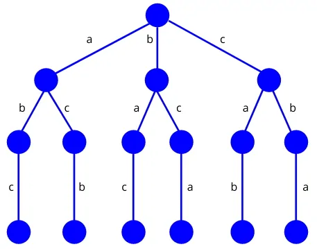

# **Sudoku-solver**
### **Sudoku solver written in python by using backtracking algorithm :)**

 

# What is backtracking algorithm ?
**`Backtracking`** is a recursive algorithm used to find all solutions to a problem by building them incrementally. It eliminates solutions that cannot reach the desired answer and uses recursive calling to create solutions step by step. It's used when there's a sequence of objects and each has a goal.

The State Space Tree search tree is used to find solutions. Each branch represents a variable and each level represents a solution. Backtracking with Depth First Search (DFS) is used to design the algorithm. A bounding function helps to check when the solution reaches the correct answer.

If the solution was suitable, the backward method continues searching, and if the solution is not suitable, the branch is removed and the algorithm returns to the previous level, and this method is also called pruning.

 

## An example of the backward method in algorithm design
-------------------------------
 
In this section, for better understanding, a simple example is presented to explain the theory of this algorithm. 

In this example, there are three letters `b`, `a` and `c`, and the purpose of sorting these three letters is to ensure that the letter `c` is not next to the letter `a`. 

According to the backward method in algorithm design, first, to solve this example, the state space tree is created and all possible solutions are checked and found and compared with the defined constraint (letter `c` should not be placed next to letter `a`). Then only a solution remains that exists according to the constraint defined in the example. The following figure shows the state space tree of this example along with its available solutions. 

 

 

All possible solutions for the above example are as follows:
* **(a,b,c)**
* **(a,c,b)**
* **(b,a,c)**
* **(b,c,a)**
* **(c,a,b)**
* **(c,b,a)**
* **(a,b,c)**
* **(a,c,b)**
* **(b,a,c)**
* **(b,c,a)**
* **(c,a,b)**
* **(c,b,a)**

However, valid solutions for this example are those that check and satisfy the query constraint as they require. Therefore, only the answers `(a,b,c)` and `(c,b,a)` remain as the final answer in the collected set. 

 

## What kind of problems backtracking can solve ?

Here are some examples of problems that can be solved using the backtracking algorithm:

 

**1 - N-Queens Problem**: Given an N x N chessboard, place N queens on the board in such a way that no two queens can attack each other.

**2 - Sudoku Puzzle**: Fill in the empty cells of a 9 x 9 grid with digits from 1 to 9 in such a way that each row, column, and 3 x 3 subgrid contains all the digits from 1 to 9 without repetition.

**3 - Knight's Tour Problem**: Find a sequence of moves for a knight on a chessboard that visits every square exactly once.

**4 - Graph Coloring Problem**: Given an undirected graph, assign a color to each vertex in such a way that no two adjacent vertices have the same color.

**5 - Subset Sum Problem**: Given a set of integers, find all possible subsets whose sum is equal to a given target value.

 

 

## Clone the code, run  it and enjoy :)

 
 

## License & copyright

MIT License
 
© Arta Moghaddasi
